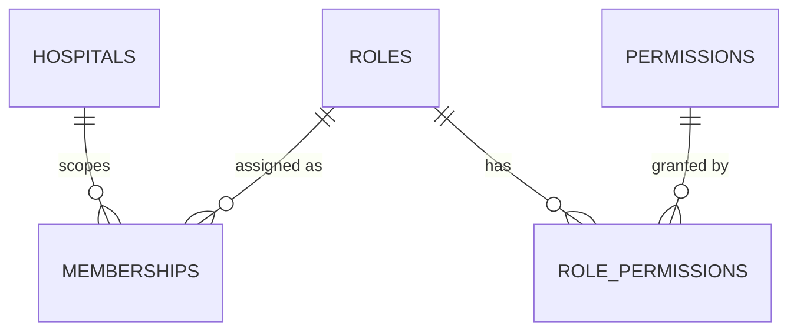
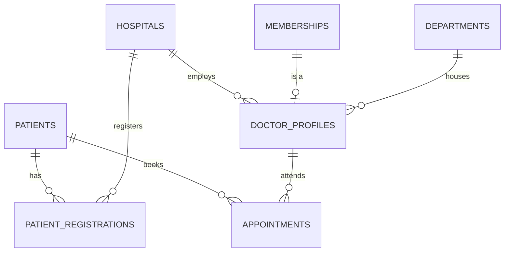
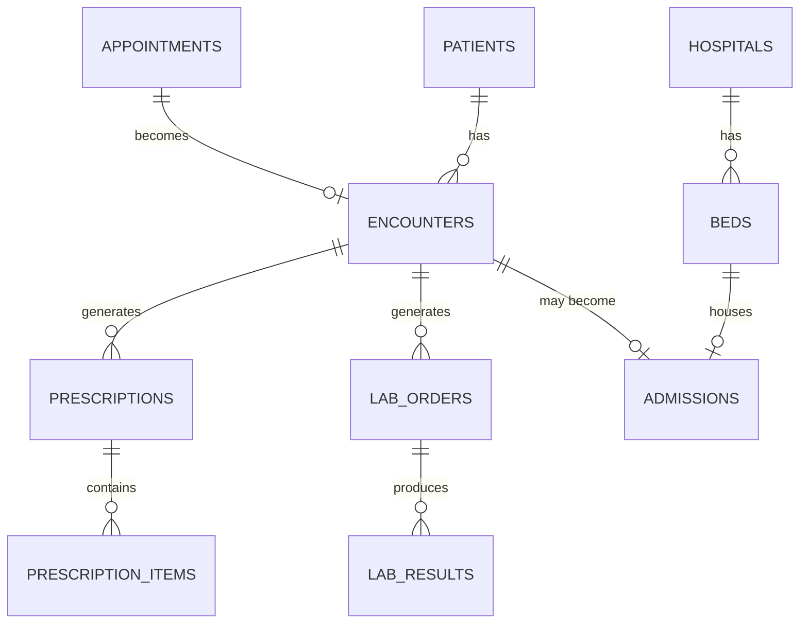
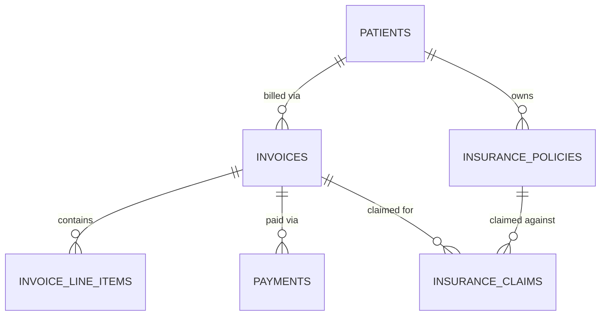

# Database Schema Reference

Consolidated view of everything in `backend/migrations/0001` through `0013`. This is a
reference for quickly loading context — the migration files remain the source of truth for
exact column definitions, constraints, and RLS policies.

## Identity & RBAC

| Table | Purpose | Key columns |
|---|---|---|
| `hospitals` | The tenant boundary | `name`, `registration_number`, `is_active` |
| `roles` | 9 seeded roles, platform or hospital scope | `name`, `scope` |
| `permissions` | 33 seeded `domain.action` keys | `key`, `description` |
| `role_permissions` | Role → permission grants | `role_id`, `permission_id` |
| `role_inheritance` | Exists, deliberately unused — see `0008` | `parent_role_id`, `child_role_id` |
| `memberships` | User × hospital × role | `user_id`, `hospital_id`, `role_id`, `status` |

**Key functions**: `rbac_effective_hospital_permission(user_id, hospital_id, permission)` —
the resolver every hospital-scoped RLS policy calls. `rbac_user_has_permission_anywhere(user_id, permission)`
is the hospital-agnostic companion, used only where scope genuinely can't be checked yet
(patient creation, before any registration row exists).

## Patients, doctors, appointments

| Table | Purpose | Key columns |
|---|---|---|
| `patients` | Hospital-agnostic patient identity | `full_name`, `dob`, `abha_id` (Phase 5) |
| `patient_registrations` | Join: patient × hospital, hospital-specific MRN | `hospital_patient_number` |
| `departments` | Per-hospital departments/wards | `name` |
| `doctor_profiles` | Doctor-specific fields on top of a membership | `specialization`, `registration_number`, `consultation_fee` |
| `appointments` | Booking | `scheduled_at`, `status` |

## Clinical (Phase 2)

| Table | Purpose | Key columns |
|---|---|---|
| `encounters` | The actual OPD/IPD visit | `vitals` (jsonb), `diagnosis`, `status` |
| `prescriptions` / `prescription_items` | Insert-only | `medicine_name`, `dosage`, `frequency` |
| `lab_orders` / `lab_results` | Insert-only results | `test_name`, `status`, `result_value` |
| `beds` | Physical ward beds | `bed_number`, `status` |
| `admissions` | IPD stay | One active admission per bed, enforced by a partial unique index |

## Pharmacy (Phase 2)

| Table / view | Purpose |
|---|---|
| `inventory_items` | Stock catalog |
| `stock_transactions` | Insert-only ledger — purchase / dispense / adjustment / return |
| `inventory_current_stock` (view) | Derives current stock from the ledger, not a stored counter |

## Billing & insurance (Phase 3)

| Table / view | Purpose |
|---|---|
| `invoices` | GST-aware: `subtotal`, `cgst_total`, `sgst_total`, `total_amount` |
| `invoice_line_items` | Polymorphic `reference_type`/`reference_id`; carries `hsn_sac_code` |
| `payments` | Insert-only ledger; positive = payment, negative = refund |
| `invoice_balance` (view) | Derives balance from `payments`, not a stored field |
| `insurance_policies` | Patient-owned, not hospital-owned |
| `insurance_claims` | `claim_type`: cashless \| reimbursement |

## Operations (Phase 4)

| Table / view | Purpose |
|---|---|
| `staff_shifts` | No DB-level overlap prevention — see `README.md`'s "Known gaps" |
| `bed_occupancy_summary` (view) | `reports.read`-gated |
| `daily_revenue_summary` (view) | `reports.read`-gated |
| `low_stock_alert` (view) | `reports.read`-gated |

## ABDM integration (Phase 5 — scaffold, see `docs/PHASE5_ABDM_INTEGRATION.md`)

| Table | Purpose |
|---|---|
| `abdm_link_requests` | M1/M2: ABHA verification and care-context linking, tracked from initiation to callback resolution |
| `abdm_consent_artifacts` | M3: consent requests this hospital sent as HIU, through grant/denial |
| `abdm_callback_log` | Raw audit log of every inbound ABDM callback — no RLS, service-role only |

`patients` also gained `abha_address` and `abha_verified` columns in this phase, alongside the
`abha_id` column from Phase 1.

## Totals

28 tables, 5 views, across 15 migrations. Role and permission counts: see `README.md`.
